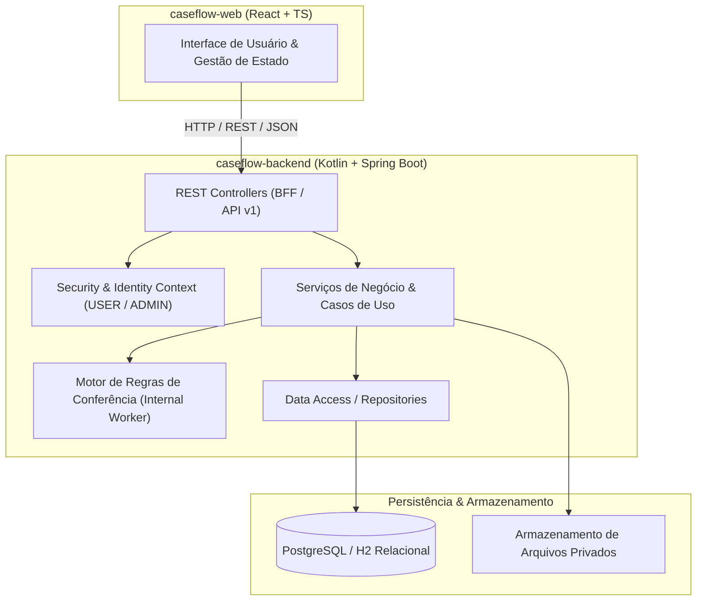

# Decisões de Arquitetura (ADRs) — CaseFlow

## Visão Geral do Sistema
O **CaseFlow** centraliza o recebimento de solicitações, a gestão de documentos comprobatórios e a conferência automatizada baseada em regras determinísticas.

---

## ADR 001: Backend em Kotlin com Spring Boot 3
* **Status:** Aceito
* **Contexto:** Necessidade de código idiomático, conciso, seguro contra nulos e de alta produtividade para o ecossistema JVM, respeitando o modelo arquitetural do CaseFlow.
* **Decisão:** Utilizar Kotlin 2.x com Spring Boot 3.x (Spring Web, Spring Data JPA, Spring Validation, Spring Security).
* **Consequência:** Eliminação de boilerplate (getters/setters/equals/hashCode via `data class`), tipagem estrita com null-safety nativa e compatibilidade total com o ecossistema Java enterprise.

---

## ADR 002: Processamento Assíncrono com Executor Interno
* **Status:** Aceito
* **Contexto:** As solicitações enviadas passam por análise documental que pode envolver verificações e simulação assíncrona durável. No MVP, a introdução de mensageria externa (RabbitMQ/Kafka) adicionaria complexidade operacional desnecessária.
* **Decisão:** Persistir `PROCESSING_JOB` no banco de dados e processar via executor assíncrono interno gerenciado pelo Spring (`@Async` / `ScheduledExecutorService`).
* **Consequência:** Persistência transacional do aceite (`202 Accepted`) com garantia de durabilidade mesmo em reinicializações da aplicação, sem dependência de message broker externo no MVP.

---

## ADR 003: Separação entre Regras de Negócio e Falhas Técnicas
* **Status:** Aceito
* **Contexto:** Uma solicitação não deve ser marcada como rejeitada se houver uma falha de I/O ou instabilidade temporária no armazenamento de arquivos.
* **Decisão:**
  - `APROVADA`: Todos os documentos obrigatórios (`IDENTIFICACAO` e `COMPROVANTE_ENDERECO`) estão presentes e vigentes.
  - `REJEITADA`: Documento obrigatório ausente ou validade expirada (motivos de negócio registrados em `reasonCodes`).
  - `FALHA_TECNICA`: Erro no acesso ao arquivo, corrupção de dados ou falha de infraestrutura. Permite reprocessamento pelo Administrador via `/cases/{id}/retry`.

---

## ADR 004: Frontend Desacoplado com Modo Mock Híbrido
* **Status:** Aceito
* **Contexto:** O projeto precisa ser demonstrado localmente de forma simples e rápida, mesmo em ambientes com limitações de runtime JVM/Docker ou durante apresentações.
* **Decisão:** O frontend React (Vite + TypeScript) implementa uma camada de serviço que suporta alternar perfeitamente entre o Backend Kotlin (`/api/v1` e `/bff/v1`) e um provedor Mock em memória totalmente funcional e reativo.
* **Consequência:** Demonstração garantida e imediata, com capacidade de conectar ao backend Kotlin real em ambiente completo.

---

## ADR 005: Reenvio de Submissão e Cabeçalho de Idempotência
* **Status:** Aceito
* **Contexto:** O frontend legado pode enviar o cabeçalho `Idempotency-Key`, mas a implementação atual não armazena nem compara seu valor.
* **Decisão:** Manter o cabeçalho opcional para compatibilidade. O serviço de submissão retorna o estado atual sem criar outro job quando a solicitação já saiu de `RASCUNHO`; o retry continua restrito a `FALHA_TECNICA`.
* **Consequência:** A proteção de reenvio é baseada no estado do caso, não na chave. Idempotência durável por chave exigiria armazenamento e contrato adicionais.
