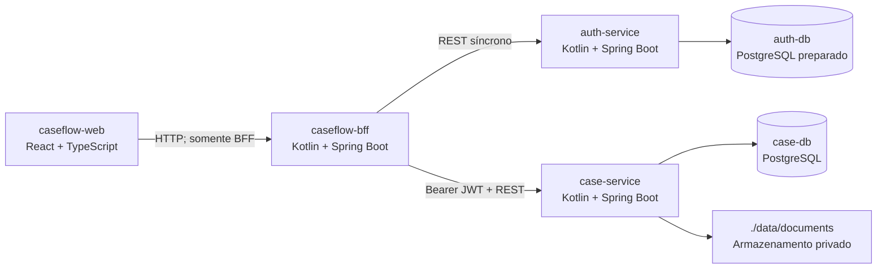

# Decisões de Arquitetura (ADRs) — CaseFlow

## Visão Geral do Sistema

O **CaseFlow** centraliza o recebimento de solicitações, a gestão de documentos comprobatórios e a conferência automatizada baseada em regras determinísticas. A arquitetura aprovada contém quatro aplicações independentes: `caseflow-web`, `caseflow-bff`, `auth-service` e `case-service`.

- **caseflow-web:** interface e estado de apresentação; consome somente a API do BFF.
- **caseflow-bff:** contrato voltado à interface; integra os serviços internos por clients REST e não possui banco de domínio.
- **auth-service:** autenticação demonstrativa, atribuição de roles e emissão de JWT assinado.
- **case-service:** solicitações, documentos, análise, notificações, histórico, autorização, idempotência e jobs persistidos.
- **Persistência:** `case-db` pertence ao case-service; auth-service mantém conexão preparada com `auth-db`, sem persistir contas no MVP. Documentos ficam em storage local do case-service.

---

## ADR 001: Backend em Kotlin com Spring Boot 3
* **Status:** Aceito
* **Contexto:** Necessidade de código idiomático, conciso, seguro contra nulos e de alta produtividade para o ecossistema JVM, respeitando o modelo arquitetural do CaseFlow.
* **Decisão:** Utilizar Kotlin 2.x com Spring Boot 3.x nos serviços `caseflow-bff`, `auth-service` e `case-service`, conforme as versões fixadas em `tech-stack.md`.
* **Consequência:** Eliminação de boilerplate, tipagem estrita com null-safety nativa e compatibilidade com o ecossistema Java enterprise, mantendo builds e contratos independentes por aplicação.

---

## ADR 002: Processamento Assíncrono Persistido com Scheduler
* **Status:** Aceito
* **Contexto:** As solicitações enviadas passam por análise documental que pode envolver verificações e execução assíncrona durável. No MVP, introduzir mensageria externa (RabbitMQ/Kafka) adicionaria complexidade operacional desnecessária.
* **Decisão:** Persistir `ProcessingJob` junto ao aceite da submissão e processá-lo por scheduler interno do case-service, com lock, lease, token e recuperação de jobs pendentes ou com lease expirado. A primeira falha técnica reagenda em 10 segundos; a segunda em 30 segundos; a terceira termina em `FALHA_TECNICA`.
* **Consequência:** O aceite e o trabalho são duráveis, sem depender de `@Async` da requisição, Kafka, RabbitMQ ou worker independente.

---

## ADR 003: Separação entre Regras de Negócio e Falhas Técnicas
* **Status:** Aceito
* **Contexto:** Uma solicitação não deve ser rejeitada por uma falha de I/O ou instabilidade temporária no armazenamento de arquivos.
* **Decisão:**
  - `APROVADA`: documentos obrigatórios em estado `READY` e vigentes atendem às regras.
  - `REJEITADA`: categoria obrigatória ausente ou validade expirada; motivos são registrados em `reasonCodes` e não geram retry.
  - Upload inválido (MIME, tamanho ou assinatura) é recusado no upload.
  - `FALHA_TECNICA`: arquivo persistido ausente, ilegível ou com integridade divergente, ou outra falha de infraestrutura; aplica-se a política de retry.
* **Consequência:** Falhas de negócio e técnicas permanecem distintas; o serviço nunca fabrica ou retorna bytes PDF substitutos.

---

## ADR 004: Frontend Desacoplado e BFF como Único Ponto de Entrada
* **Status:** Aceito
* **Contexto:** O projeto precisa ser demonstrado localmente de forma simples e rápida, sem expor os contratos internos dos serviços ao frontend.
* **Decisão:** `caseflow-web` comunica-se exclusivamente com `caseflow-bff`. O BFF mantém DTOs próprios e adapta os contratos de auth-service e case-service. O frontend não possui fallback local de negócio que mascare respostas HTTP.
* **Consequência:** Os serviços internos podem evoluir sem expor seus contratos à interface; respostas HTTP 4xx/5xx são propagadas como erros funcionais.

---

## ADR 005: Idempotência em Operações de Submissão e Reprocessamento
* **Status:** Aceito
* **Contexto:** Evitar duplicação acidental de execuções ou transições de estado quando houver reenvio de formulário ou timeout de rede.
* **Decisão:** Exigir `Idempotency-Key` em submit e retry. Persistir chave, operação, hash do contexto e resposta no case-service. A mesma chave/operação/contexto retorna a resposta original; contexto diferente retorna `409 Conflict`.
* **Consequência:** Repetições equivalentes não criam novos jobs ou efeitos associados. O BFF encaminha a chave recebida sem substituí-la.

---

## ADR 006: Autenticação Demonstrativa com JWT Bearer Real
* **Status:** Aceito
* **Contexto:** O MVP precisa ser executável localmente sem provedor externo de identidade, preservando autenticação e autorização por token entre processos.
* **Decisão:** auth-service aceita username e password não vazios sem persistir contas; username contendo `admin` recebe `ADMIN`, os demais `USER`. Emite JWT HMAC-SHA256 com `sub` UUID determinístico, `roles`, `iat`, `exp` e `iss=caseflow-auth-service`. BFF e case-service validam o JWT independentemente. `CASEFLOW_JWT_SECRET` vem do ambiente e deve ter ao menos 32 bytes; `CASEFLOW_JWT_TTL_SECONDS` define o TTL, com padrão de 3.600 segundos.
* **Consequência:** As credenciais são mockadas, mas a assinatura e a validação do JWT são reais. Não se usam OIDC, sessão no BFF, `X-User-Email`, usuário padrão nem token textual.

---

## ADR 007: Persistência por Serviço e Armazenamento de Documentos
* **Status:** Aceito
* **Contexto:** Serviços precisam manter propriedade de dados e execução local reproduzível.
* **Decisão:** case-service persiste domínio e jobs em `case-db`; auth-service mantém `auth-db` preparado, sem contas persistidas; caseflow-bff não possui banco. Documentos PDF são armazenados em `./data/documents` por porta de storage do case-service. Testes backend usam H2.
* **Consequência:** Não há consultas diretas ou foreign keys entre bancos de serviços diferentes. O storage pode ser substituído futuramente sem alterar as regras de domínio.

---

## ADR 008: Comunicação Síncrona entre Aplicações
* **Status:** Aceito
* **Contexto:** A UI precisa de um contrato estável e os serviços devem permanecer independentes, sem chamadas locais que contornem suas fronteiras.
* **Decisão:** O navegador chama somente o BFF; o BFF chama auth-service e case-service por REST/HTTP síncrono, usando clients dedicados. Propaga `Authorization`, `Idempotency-Key` e `Correlation-Id` quando aplicável e traduz erros downstream sem stack trace.
* **Consequência:** O BFF não acessa o banco de case-service; indisponibilidade downstream é reportada como erro seguro ao cliente.
