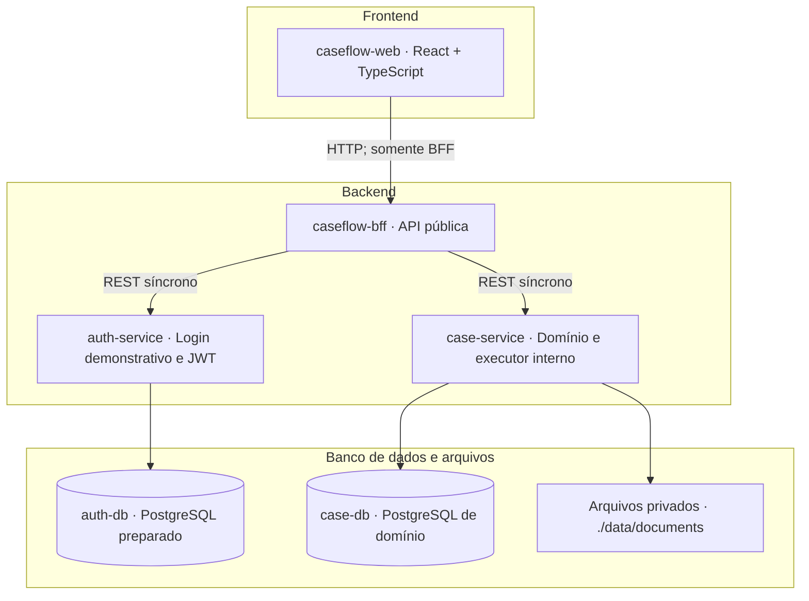
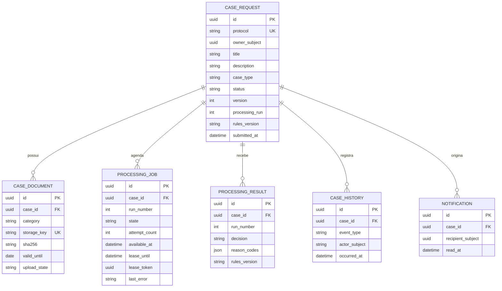
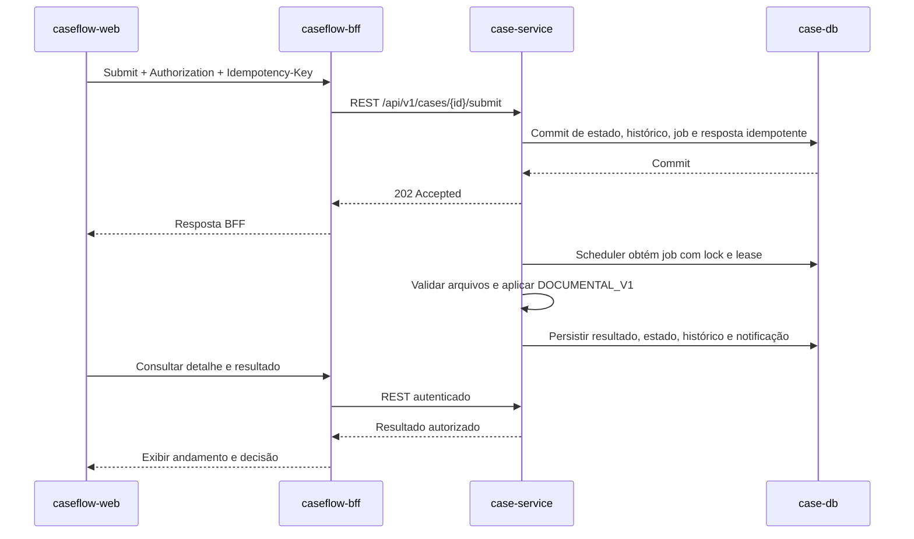
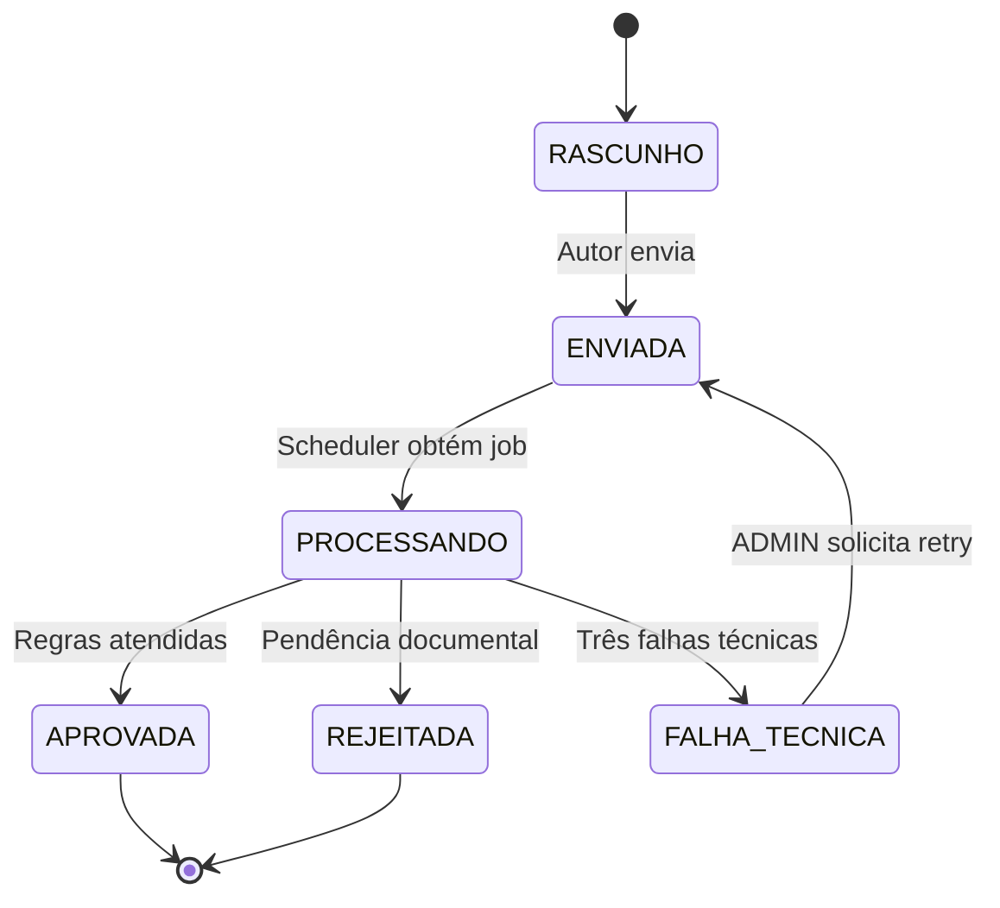

# Prática — Criando a arquitetura de um sistema

**Projeto:** CaseFlow — Solicitações e conferência documental  
**Data original:** 22 de setembro de 2026

**Atualização:** 26 de setembro de 2026

**Formato:** Markdown com diagramas Mermaid  
**Situação:** arquitetura e fluxos descritos conforme o MVP implementado; não é declaração de prontidão para produção

## 1. Problema, objetivo e recorte

Quando documentos para cadastro são enviados por canais dispersos, o solicitante perde visibilidade sobre o andamento e a equipe precisa conferir repetidamente quais arquivos chegaram e quais estão pendentes. O CaseFlow centraliza a solicitação, seus documentos e o resultado da conferência em um único fluxo rastreável.

O usuário cria uma solicitação, anexa documentos, envia para análise determinística e acompanha aprovação ou rejeição com os respectivos motivos. Um administrador consulta solicitações e trata falhas técnicas.

Esta entrega adapta o documento **CaseFlow-SDD-v0.1.md** ao exercício e registra o estado do MVP. Mantém um frontend e três serviços backend independentes: BFF, negócio e autenticação. As credenciais são demonstrativas; os limites entre aplicações e os contratos REST são reais.

**Limite da análise:** conferir presença dos documentos obrigatórios, validade declarada e disponibilidade/integridade dos arquivos. Aprovação não comprova autenticidade, identidade ou conteúdo documental. Não há IA, OCR ou aprovação humana neste MVP.

## 2. Funcionalidades principais

| ID | Funcionalidade | Resultado implementado |
| --- | --- | --- |
| F01 | Login e logout local | O frontend obtém JWT pelo BFF e mantém o token em memória; logout limpa o estado local. Não há conta persistida nem sessão OIDC. |
| F02 | Criar e editar solicitação | Rascunho com título, descrição, autor e protocolo; atualização usa `version`. |
| F03 | Anexar, baixar e remover documentos | PDFs privados vinculados à solicitação, armazenados pelo case-service em diretório local persistente. |
| F04 | Enviar para análise | Aceite `202` após persistir submissão, chave de idempotência e job. |
| F05 | Executar conferência automática | Resultado determinístico com decisão e códigos de motivo da versão `DOCUMENTAL_V1`. |
| F06 | Consultar andamento e histórico | Lista, detalhe, documentos, resultado e transições rastreáveis sob autorização do serviço. |
| F07 | Receber notificação interna | Notificação persistida e consultável somente pelo destinatário. |
| F08 | Reprocessar falha técnica | Nova execução solicitada por ADMIN com justificativa e chave idempotente. |

### Regras essenciais

- Tipo único: `ANALISE_DOCUMENTAL`; título de 5 a 120 caracteres e descrição de 20 a 2.000 caracteres.
- Somente o autor pode editar e enviar seu rascunho. Depois do envio, os dados e documentos ficam imutáveis.
- USER consulta e altera apenas recursos próprios. ADMIN consulta casos de terceiros, mas não edita rascunhos alheios nem recebe acesso às notificações de terceiros.
- Até três documentos ativos, um por categoria: `IDENTIFICACAO`, `COMPROVANTE_ENDERECO` e `COMPLEMENTAR`. O envio exige pelo menos um documento `READY`; a falta de outra categoria obrigatória pode ser enviada para receber o resultado da análise.
- Aceitam-se somente PDFs com MIME `application/pdf`, tamanho máximo de 5 MiB e assinatura básica `%PDF-`. `validUntil` é opcional; se informado, a análise compara com a data UTC do envio.
- Categoria obrigatória ausente ou validade expirada gera `REJEITADA`. Arquivo persistido ausente, ilegível ou com tamanho/hash divergente é falha técnica, nunca motivo para fabricar conteúdo.
- Falhas técnicas repetem após 10 e 30 segundos; a terceira falha termina em `FALHA_TECNICA`. Rejeição de negócio não entra em retry.
- `Idempotency-Key` é obrigatória em submit e retry. Mesmo contexto repete a resposta; reutilização da mesma chave com outro contexto resulta em `409`.

## 3. Usuários e permissões

| Ação | Solicitante — USER | Administrador — ADMIN |
| --- | --- | --- |
| Criar solicitação | Em nome próprio | Em nome próprio |
| Editar rascunho e alterar anexos | Somente próprios | Somente próprios |
| Enviar solicitação | Somente própria | Somente própria |
| Consultar solicitações, documentos e histórico | Somente próprios | Todas, para suporte |
| Ler e marcar notificações | Somente próprias | Somente próprias |
| Reprocessar falha técnica | Não | Sim, com justificativa de 10 a 500 caracteres |
| Alterar resultado manualmente | Não | Não |

O auth-service aceita username e senha não vazios sem persistir contas. Username contendo `admin` recebe role `ADMIN`; qualquer outro recebe `USER`. O `sub` é um UUID determinístico derivado do username. Apesar do login demonstrativo, o JWT é assinado e validado de verdade. O case-service repete a validação do token e aplica autorização por recurso; a UI não é fronteira de segurança.

## 4. Diagrama de arquitetura

| Componente | Responsabilidade | Persistência |
| --- | --- | --- |
| Frontend | Formulários, lista, detalhe, notificações e acompanhamento do status; consome somente o BFF. | Nenhum banco de domínio; JWT apenas em memória. |
| BFF — Backend for Frontend | API pública, validação JWT, adaptação de DTOs, clients REST e tradução segura de erros. | Sem banco próprio. |
| Serviço de autenticação | Aceitar credenciais demonstrativas, determinar role e emitir/validar JWT HMAC-SHA256. | Conexão PostgreSQL preparada; não persiste usuários. |
| Serviço de negócio | Regras, autorização por recurso, documentos, jobs, resultados, histórico e notificações. | PostgreSQL `case-db` e arquivos locais. |
| Banco de autenticação | Componente PostgreSQL isolado preparado para auth-service. | `auth-db`; sem contas persistidas no MVP. |

O repositório organiza os processos independentes em `apps/frontend/caseflow-web/` e `apps/backend/{caseflow-bff,auth-service,case-service}/`. O navegador chama apenas o BFF. No Compose, os backends usam DNS interno; auth-service e case-service não publicam portas no host. O Compose publica web em `5173` e BFF em `8081`; as portas locais isoladas padrão de auth-service e case-service são `8082` e `8080`, respectivamente.

### Camadas internas do serviço de negócio

| Camada | Conteúdo | Exemplo |
| --- | --- | --- |
| Interfaces REST | Controllers, DTOs e validação de entrada | Receber envio de solicitação |
| Aplicação | Casos de uso, coordenação e portas | Persistir envio e criação de job |
| Domínio | Modelos, estados, regras e políticas | Impedir edição após envio |
| Infraestrutura | Adaptadores JPA, arquivos, segurança e scheduler | Repositórios PostgreSQL e storage local |

O BFF não acessa o banco de negócio. O auth-service e o case-service mantêm contratos, configurações e dependências próprios. Não há banco `bff_db`, worker independente nem broker no MVP.

## 5. Entidades e relacionamentos

### Modelo de negócio — case_db

Uma solicitação possui documentos, eventos e execuções. O case-service também persiste `IdempotencyRecord`, que associa chave/operação/contexto à resposta original. As identidades aparecem como UUIDs estáveis em `owner_subject`, `recipient_subject` e nos atores do histórico; não há FK entre bancos. Eventos automáticos usam ator `SYSTEM`.

### Identidade — auth-db

O auth-service mantém conexão com `auth-db`, mas o MVP não persiste contas, papéis ou credenciais. A autenticação de credenciais é demonstrativa; o conteúdo e a validade do JWT são reais e verificados por auth-service, BFF e case-service conforme suas fronteiras.

### Dados técnicos complementares

| Dado | Local | Finalidade |
| --- | --- | --- |
| Jobs e resultados | `case-db` | Persistir submissões, leases, tentativas e decisões |
| Histórico e notificações | `case-db` | Rastrear transições e informar o proprietário |
| Chaves de idempotência | `case-db` | Reproduzir respostas sem duplicar jobs/efeitos |
| Arquivos | `./data/documents` | Armazenar conteúdo privado; banco mantém apenas metadados e `storage_key` |

Restrições de domínio incluem protocolo único, até três documentos ativos por caso e uma categoria ativa por documento. O campo `version` protege alterações concorrentes; a chave de idempotência é única por operação.

## 6. Endpoints principais da API

Prefixo público de negócio do BFF: **`/bff/v1`**. O login público também passa pelo BFF em **`POST /api/v1/auth/login`**. O auth-service e o case-service não são chamados diretamente pelo navegador.

| Método | Rota pública | Acesso | Retorno de sucesso |
| --- | --- | --- | --- |
| POST | `/api/v1/auth/login` | Público | 200: JWT e identidade demonstrativa |
| POST | `/bff/v1/cases` | USER / ADMIN autenticado | 201: novo rascunho |
| GET | `/bff/v1/cases` | USER / ADMIN autenticado | 200: próprias solicitações; ADMIN consulta todas |
| GET | `/bff/v1/cases/{id}` | Autor / ADMIN | 200: detalhe e resultado mais recente |
| PUT | `/bff/v1/cases/{id}` | Autor, em RASCUNHO | 200: dados e versão atualizados |
| POST | `/bff/v1/cases/{id}/documents` | Autor, em RASCUNHO | 201: anexo PDF após validação |
| DELETE | `/bff/v1/cases/{id}/documents/{documentId}` | Autor, em RASCUNHO | 204: remoção concluída |
| GET | `/bff/v1/cases/{id}/documents/{documentId}/content` | Autor / ADMIN | 200: download privado |
| POST | `/bff/v1/cases/{id}/submit` | Autor, em RASCUNHO | 202: envio persistido |
| GET | `/bff/v1/cases/{id}/history` | Autor / ADMIN | 200: histórico |
| POST | `/bff/v1/cases/{id}/retry` | ADMIN, em FALHA_TECNICA | 202: nova execução |
| GET | `/bff/v1/notifications` | Destinatário | 200: notificações próprias |
| PATCH | `/bff/v1/notifications/{id}` | Destinatário | 200: notificação marcada como lida |

O auth-service também expõe internamente `POST /api/v1/auth/login` e `GET /api/v1/auth/me`. O case-service expõe suas operações sob `/api/v1`; o BFF encaminha os contratos públicos por clients REST. Os três backends disponibilizam `GET /health` para healthchecks.

Chamadas protegidas enviam `Authorization: Bearer <jwt>`. Submit e retry exigem `Idempotency-Key`; `Correlation-Id` é opcional. Erros downstream são traduzidos sem stack trace, segredo, JWT ou conteúdo privado. Exemplos completos de payloads e respostas estão em [`api-contracts.md`](api-contracts.md).

## 7. Tecnologias sugeridas e utilizadas

| Área | Stack observada | Finalidade |
| --- | --- | --- |
| Backend | Kotlin 2.0.20, Java 21, Spring Boot 3.3.4 | Serviços independentes e APIs REST |
| Build backend | Gradle Kotlin DSL 8.10.2 e Gradle Wrapper | Build e testes; Maven não é usado |
| Persistência | PostgreSQL 16 em runtime; H2 em testes | Dados transacionais por serviço |
| Segurança | Spring Security e JWT HMAC-SHA256 | Autenticação demonstrativa e autorização por recurso |
| Frontend | React 18, TypeScript, Vite e Tailwind CSS | Aplicação web servida por Nginx |
| Infraestrutura | Docker e Docker Compose | Execução local integrada de seis serviços |

Não há OAuth Provider externo, Keycloak, Kafka, RabbitMQ, Redis, MinIO, S3, Kubernetes, Service Mesh, OCR ou OpenTelemetry nesta versão. O storage de arquivos é local e a análise é determinística.

## 8. Fluxos principais

### 8.1 Autenticação

1. A UI envia username e senha não vazios para `POST /api/v1/auth/login` no BFF.
2. O BFF chama auth-service por REST; credenciais contendo `admin` no username recebem role ADMIN, as demais USER.
3. O auth-service emite um JWT assinado com `sub`, roles, `iat`, `exp` e `iss=caseflow-auth-service`.
4. O frontend mantém o JWT somente em memória e envia `Authorization: Bearer <jwt>` nas chamadas ao BFF.
5. BFF e case-service validam o JWT independentemente. O case-service verifica ownership e papel antes de cada operação.

### 8.2 Criação, documentos e envio

1. O solicitante cria um rascunho e recebe ID, protocolo e versão.
2. Upload e download passam pelo BFF; o case-service valida MIME `application/pdf`, tamanho máximo de 5 MiB e cabeçalho `%PDF-`, grava no storage local e mantém SHA-256 nos metadados.
3. O envio exige pelo menos um documento `READY`; a ausência de outra categoria obrigatória pode ser enviada para obter o resultado de pendência.
4. Submit exige versão e `Idempotency-Key`. Na transação, o case-service atualiza o estado e persiste job e resposta idempotente.
5. O BFF retorna `202 Accepted` depois do commit. Repetição equivalente devolve a resposta original sem criar outro job.

### 8.3 Processamento e resultado

O scheduler consulta jobs persistidos dentro do case-service. Se o processo reiniciar, jobs `SCHEDULED` ou com lease expirado continuam recuperáveis. O lease/token impede que um executor que perdeu a concessão sobrescreva o resultado atual.

### 8.4 Estados e reprocessamento

A primeira falha técnica agenda retry após 10 segundos; a segunda, após 30 segundos; a terceira termina job/caso em `FAILED`/`FALHA_TECNICA`. Rejeições de negócio não recebem retry. Cada falha técnica notifica o titular. Retry ADMIN requer justificativa de 10 a 500 caracteres, preserva os documentos e a referência original e incrementa `processingRun`.

## 9. Decisões e critérios para implementação

| Decisão | Benefício e limite observado |
| --- | --- |
| Frontend + BFF + auth-service + case-service | Separa apresentação, entrada web, identidade e domínio; exige operar quatro aplicações |
| JWT real com credenciais mockadas | Mantém validação de token e demonstra papéis, mas não fornece identidade de produção |
| Jobs no PostgreSQL e executor interno | Mantém trabalho durável sem broker; processamento compartilha recursos do case-service |
| Bancos auth/case separados | Define propriedade de dados; auth mantém conexão preparada, sem contas persistidas |
| Arquivos locais por porta de storage | Permite desenvolvimento Compose; não oferece storage remoto no MVP |
| Regras determinísticas | Produz resultados reproduzíveis; não comprova autenticidade nem conteúdo documental |

### Critérios de aceite verificados

- USER não consulta caso alheio; ADMIN consulta casos globais e não edita rascunhos de terceiros.
- PDFs válidos, completos e vigentes resultam em aprovação; pendências documentais resultam em rejeição com motivos.
- Repetição da mesma operação/chave/contexto não cria outro job; contexto diferente retorna `409`.
- Jobs e retries técnicos persistem; a recuperação após restart foi demonstrada no Compose.
- ADMIN consegue solicitar retry de `FALHA_TECNICA` com justificativa; erro técnico não é mascarado como rejeição.
- A matriz de aderência e a cobertura incompleta conhecida estão em [`compliance-matrix.md`](compliance-matrix.md).

A matriz não declara prontidão para produção. O MVP conserva limites e riscos documentados em [`mvp-scope.md`](mvp-scope.md), incluindo validação PDF básica e dados seed cujo arquivo físico pode estar ausente.

## 10. Registro da atividade e prompts existentes

A atividade original desta prática solicitava um documento Markdown de arquitetura, diagramas e o registro dos prompts utilizados. O enunciado está reproduzido abaixo em forma resumida; os prompts existentes e atualizados permanecem em `docs/01-prompt-contexto.md`, `docs/02-prompt-implementacao.md` e `docs/03-prompt-arquitetura-microservicos.md`.

> Prática: Criando a arquitetura de um sistema. Definir funcionalidades, tipos de usuários e permissões, diagrama frontend/backend/banco de dados, entidades e relacionamentos, endpoints REST, tecnologias sugeridas e fluxos principais. Entregar PDF ou Markdown com diagramas e indicar as ferramentas utilizadas.

Os diagramas deste documento usam Mermaid. Esta seção registra o contexto histórico da atividade; as decisões técnicas atuais estão no ADR 001 e nos quatro arquivos `.ai/`.

## 11. Referências da atividade

- Enunciado original da prática: `https://github.com/lgsreal/ai-driven-dev/blob/main/Aula_1/10_Pratica_Arquitetura.md`.
- `CaseFlow-SDD-v0.1.md`, versão 0.1, de 16/09/2026, como fonte histórica de escopo.
- [ADR 001 — Arquitetura do MVP](adr/001-mvp-architecture.md).
- [Contratos HTTP do MVP](api-contracts.md).
- [Escopo do MVP](mvp-scope.md).
