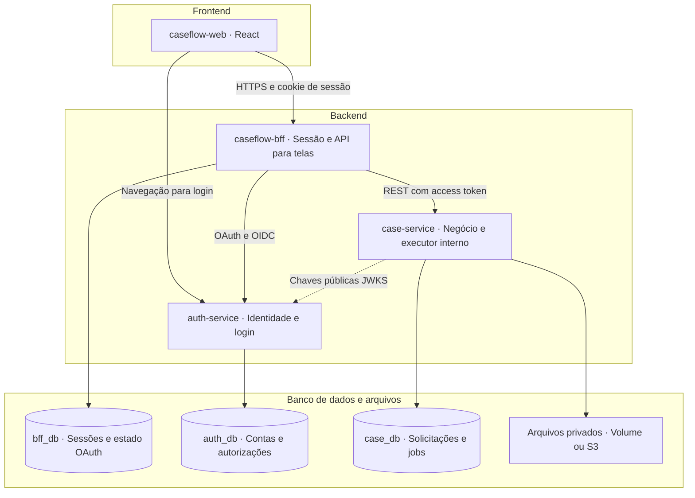
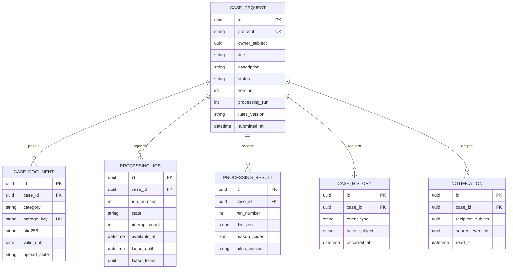
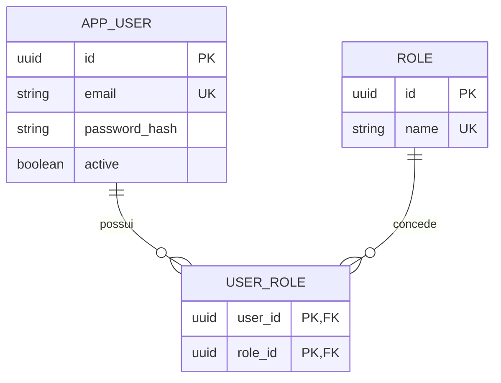
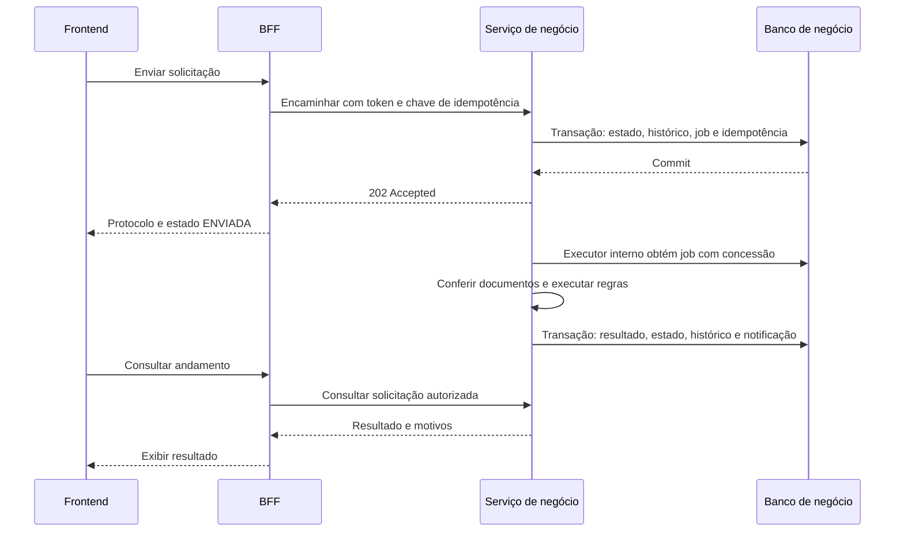
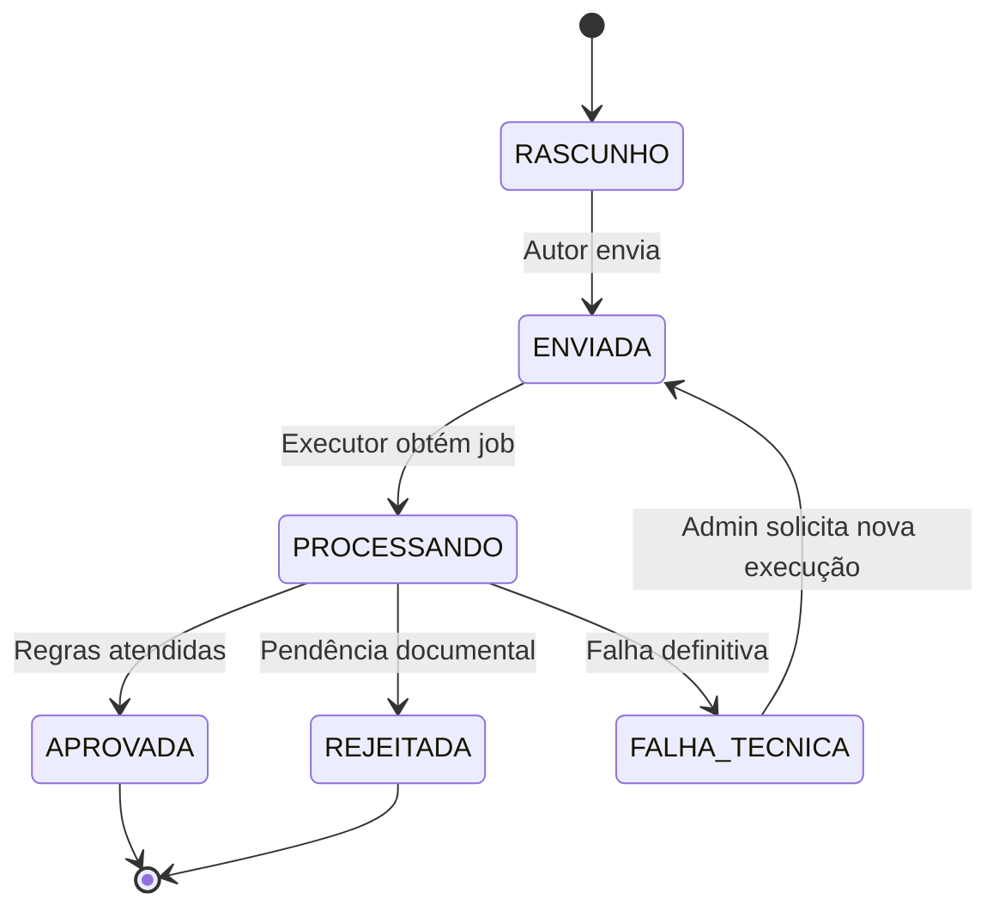

# Prática — Criando a arquitetura de um sistema

**Projeto:** CaseFlow — Solicitações e conferência documental  
**Data:** 22 de setembro de 2026  
**Formato:** Markdown com diagramas Mermaid  
**Situação:** proposta de arquitetura para implementação

## 1. Problema, objetivo e recorte

Quando documentos para cadastro são enviados por canais dispersos, o solicitante perde visibilidade sobre o andamento e a equipe precisa conferir repetidamente quais arquivos chegaram e quais estão pendentes. O CaseFlow centraliza a solicitação, seus documentos e o resultado da conferência em um único fluxo rastreável.

O usuário cria uma solicitação, anexa documentos, envia para análise automática e acompanha aprovação ou rejeição com os respectivos motivos. Um administrador consulta solicitações e trata falhas técnicas.

Esta entrega adapta o documento **CaseFlow-SDD-v0.1.md**, de 16/09/2026, ao exercício. Mantém um frontend, um BFF e dois microserviços: negócio e autenticação. As decisões representam um desenho a implementar; não indicam que o sistema já existe.

**Limite da análise:** conferir presença dos documentos obrigatórios, validade declarada e disponibilidade/integridade dos arquivos. Aprovação não comprova autenticidade, identidade ou conteúdo documental. Não há IA, OCR ou aprovação humana neste MVP.

## 2. Funcionalidades principais

| ID | Funcionalidade | Resultado esperado |
| --- | --- | --- |
| F01 | Login e logout | Acesso identificado e sessão encerrável |
| F02 | Criar e editar solicitação | Rascunho com título, descrição, autor e protocolo |
| F03 | Anexar, baixar e remover documentos | Arquivos privados vinculados à solicitação |
| F04 | Enviar para análise | Aceite imediato e processamento assíncrono durável |
| F05 | Executar conferência automática | Resultado com motivos e versão das regras |
| F06 | Consultar andamento e histórico | Lista paginada, detalhe e transições rastreáveis |
| F07 | Receber notificação interna | Resultado disponível na aplicação |
| F08 | Reprocessar falha técnica | Nova execução solicitada pelo administrador com justificativa |

### Regras essenciais

- Tipo inicial único: `ANALISE_DOCUMENTAL`.
- Título de 5 a 120 caracteres; descrição de 20 a 2.000 caracteres.
- Somente o autor pode editar e enviar seu rascunho. Dados e documentos ficam imutáveis após o envio.
- Até três PDFs, um por categoria: `IDENTIFICACAO`, `COMPROVANTE_ENDERECO` e `COMPLEMENTAR`. Limite de 5 MiB por arquivo.
- Envio exige pelo menos um anexo pronto e nenhuma operação de arquivo pendente. A interface avisa quando falta categoria obrigatória, mas permite enviar para obter o resultado de pendência.
- Aprovação exige identificação e comprovante de endereço. Uma categoria obrigatória ausente ou uma validade declarada anterior à data UTC do envio gera rejeição.
- Falha de acesso ou integridade do armazenamento é um problema técnico, separado da rejeição por regra de negócio.
- Uma solicitação rejeitada exige nova solicitação. Reprocessamento administrativo só se aplica a `FALHA_TECNICA`.

**Fora do MVP:** cadastro público, recuperação de senha por e-mail, integrações externas, múltiplas organizações, aplicativo móvel, broker de mensagens e worker independente. As contas iniciais serão provisionadas de forma controlada no serviço de autenticação.

## 3. Usuários e permissões

| Ação | Solicitante — USER | Administrador — ADMIN |
| --- | --- | --- |
| Criar solicitação | Em nome próprio | Em nome próprio |
| Editar rascunho e alterar anexos | Somente próprios | Somente próprios |
| Enviar solicitação | Somente própria | Somente própria |
| Consultar solicitações, documentos e histórico | Somente próprios | Todas, para suporte |
| Ler e marcar notificações | Somente próprias | Somente próprias |
| Reprocessar falha técnica | Não | Sim, com justificativa |
| Alterar resultado manualmente | Não | Não |

O usuário não autenticado acessa apenas a entrada e o login. O administrador não pode editar rascunhos de terceiros. O serviço de negócio verifica identidade, papel e propriedade em cada operação; o frontend apenas reflete essas permissões na interface.

## 4. Diagrama de arquitetura



| Componente | Responsabilidade |
| --- | --- |
| Frontend | Formulários, listagem, detalhe, notificações e acompanhamento do status |
| BFF — Backend for Frontend | Manter sessão e tokens no servidor, proteger operações com CSRF e adaptar respostas para as telas |
| Serviço de negócio | Aplicar regras e autorização por recurso; persistir solicitações; executar jobs; registrar resultado e histórico |
| Serviço de autenticação | Manter contas e papéis; autenticar; emitir e renovar tokens por OAuth/OIDC |
| Banco relacional | Persistir dados transacionais, sessões e trabalho pendente |
| Armazenamento de arquivos | Guardar documentos privados; o banco armazena apenas metadados e chave do arquivo |

Na execução local, uma instância PostgreSQL pode hospedar os três bancos lógicos, com credenciais independentes. Não existem consultas nem chaves estrangeiras entre bancos de serviços diferentes. O BFF não acessa o banco de negócio.

Frontend e BFF compartilham a mesma origem pública por proxy. O serviço de negócio permanece em rede interna; o login do auth é acessível ao navegador. A página de login é servida pelo auth, sem exigir outro projeto frontend.

### Camadas internas do serviço de negócio

| Camada | Conteúdo | Exemplo |
| --- | --- | --- |
| API | Controllers, DTOs e validação de entrada | Receber envio de solicitação |
| Aplicação | Casos de uso, autorização por recurso e transações | Coordenar envio e criação do job |
| Domínio | Estados, regras e decisões de negócio | Impedir edição após envio |
| Infraestrutura | Adaptadores de banco, arquivos e execução agendada | Repositórios JPA e armazenamento local |

O domínio não depende de controllers ou do fornecedor de armazenamento. O processamento é um módulo interno do `case-service`, preservando o limite de dois microserviços além do BFF.

## 5. Entidades e relacionamentos

### Modelo de negócio — case_db



Uma solicitação possui vários documentos, eventos e execuções ao longo da sua vida. No MVP, existem no máximo três documentos ativos. Cada execução tem um job e no máximo um resultado, identificados pelo par único `(case_id, run_number)` nas respectivas tabelas. Uma falha técnica pode não produzir resultado de negócio.

O diagrama apresenta campos centrais; o cadastro completo inclui datas de criação/atualização, tipo da solicitação e metadados do arquivo, como nome original, tamanho e tipo de conteúdo.

### Identidade — auth_db



O usuário pode receber um ou mais papéis. `owner_subject`, `recipient_subject` e os atores humanos do histórico guardam o identificador estável `sub` emitido pelo auth. Esse é um relacionamento lógico com a identidade, sem FK entre bancos. Eventos automáticos usam ator `SYSTEM`.

### Dados técnicos complementares

| Dado | Local | Finalidade |
| --- | --- | --- |
| Registro de idempotência | case_db | Guardar chave, ator, rota, hash do pedido e resposta para envio/reprocessamento |
| Sessão e cliente OAuth autorizado | bff_db | Manter sessão web e tokens fora do navegador |
| Clientes OAuth, autorizações e renovação | auth_db | Sustentar o protocolo de autenticação |

Restrições principais: protocolo único; uma categoria ativa de documento por solicitação; uma execução ativa por solicitação; resultado único por execução; notificação única por evento e destinatário. O campo `version` protege contra sobrescrita por edições concorrentes.

## 6. Endpoints principais da API

Prefixo público do BFF: **`/bff/v1`**. Prefixo interno do core: **`/api/v1`**. As rotas de negócio abaixo são encaminhadas ao core com o mesmo sufixo; sessão e CSRF pertencem ao BFF.

| Método | Rota após o prefixo | Acesso | Retorno de sucesso |
| --- | --- | --- | --- |
| GET | `/csrf` | Sessão inicial ou autenticada | 200: token CSRF vinculado à sessão |
| GET | `/me` | Autenticado | 200: identidade e capacidades |
| POST | `/logout` | Autenticado | 200: encerramento local e instrução de logout OIDC |
| POST | `/cases` | USER / ADMIN | 201: novo rascunho e Location |
| GET | `/cases` | Próprias / todas para ADMIN | 200: página de solicitações |
| GET | `/cases/{id}` | Autor / ADMIN | 200: detalhe, documentos e resultado |
| PUT | `/cases/{id}` | Autor, em RASCUNHO | 200: dados e versão atualizados |
| POST | `/cases/{id}/documents` | Autor, em RASCUNHO | 201: anexo pronto, após upload multipart |
| DELETE | `/cases/{id}/documents/{documentId}` | Autor, em RASCUNHO | 204: remoção concluída |
| GET | `/cases/{id}/documents/{documentId}/content` | Autor / ADMIN | 200: download privado |
| POST | `/cases/{id}/submit` | Autor, em RASCUNHO | 202: solicitação aceita para processamento |
| GET | `/cases/{id}/history` | Autor / ADMIN | 200: histórico paginado |
| POST | `/cases/{id}/retry` | ADMIN, em FALHA_TECNICA | 202: nova execução aceita |
| GET | `/notifications` | Somente destinatário | 200: notificações paginadas |
| PATCH | `/notifications/{id}` | Somente destinatário | 200: notificação marcada como lida |

**Convenções propostas:** IDs UUID; datas de eventos em UTC; paginação `page` e `size`, com padrão 20 e máximo 100; ordenação estável por data e ID. A listagem de solicitações admite `status`, `createdFrom` e `createdTo`. O backend aplica o escopo de acesso independentemente dos filtros enviados.

Escritas pelo BFF exigem CSRF. Atualização de rascunho e envio carregam `version`. Upload e remoção retornam `X-Case-Version` com a nova versão. Envio e reprocessamento exigem `Idempotency-Key`: repetição do mesmo pedido retorna o aceite original; reutilização da chave com outro conteúdo retorna `409`.

### Exemplo de contrato

`POST /bff/v1/cases`

```json
{
  "title": "Documentação para cadastro",
  "description": "Solicito a conferência dos documentos anexados para meu cadastro.",
  "type": "ANALISE_DOCUMENTAL"
}
```

`POST /bff/v1/cases/{id}/submit`, com `Idempotency-Key` e cabeçalho CSRF:

```json
{ "version": 3 }
```

Resposta ilustrativa `202 Accepted`, emitida somente após persistir solicitação e job:

```json
{
  "id": "972d8c50-742f-4b17-ae27-c968478e2eed",
  "protocol": "CF-0000000123",
  "status": "ENVIADA",
  "version": 4,
  "processingRun": 1,
  "rulesVersion": "DOCUMENTAL_V1"
}
```

Erros relevantes: `400` para entrada inválida, `401` para ausência de autenticação, `403` para papel insuficiente, `404` para recurso inexistente ou fora do escopo do solicitante, `409` para conflito de estado/versão/idempotência, `413` para arquivo muito grande e `503` para dependência indisponível. O corpo de erro contém código de negócio, mensagem segura e `traceId`.

O login começa em `/oauth2/authorization/caseflow`, com callback em `/login/oauth2/code/caseflow`, ambos no BFF. Discovery, autorização, token, revogação e JWKS são endpoints do protocolo no auth; não são CRUDs da API de negócio.

## 7. Tecnologias sugeridas

| Área | Escolha proposta | Justificativa |
| --- | --- | --- |
| Frontend | React e TypeScript | Componentes reutilizáveis e contratos tipados |
| Backend e BFF | Java 21 e Spring Boot | Alinhamento ao objetivo de aprendizagem da equipe |
| API e persistência | Spring MVC, Bean Validation, JPA e Flyway | Validação, transações e migrações explícitas |
| Autenticação | Spring Security com suporte OAuth2/OIDC e Authorization Server | Reutilização de implementação de protocolos |
| Banco | PostgreSQL | Dados relacionais e fila de jobs persistente |
| Sessões | Spring Session JDBC | Persistência no banco do BFF |
| Arquivos | Volume persistente local; S3 privado na evolução cloud | Desenvolvimento local sem depender de conta cloud |
| Documentação | Markdown, Mermaid e OpenAPI | Diagramas e contratos versionáveis junto ao código |
| Testes | JUnit, Mockito, Testcontainers e Playwright | Regras, integração com PostgreSQL e jornada no navegador |
| Execução e entrega | Docker Compose e GitHub Actions | Ambiente reproduzível e validação de mudanças |
| Observabilidade | Actuator, Micrometer e logs estruturados | Diagnóstico de falhas e acompanhamento de jobs |

As versões compatíveis de frameworks e bibliotecas serão fixadas na preparação do projeto. Este exercício não declara qual é a versão mais recente de cada tecnologia.

## 8. Fluxos principais

### 8.1 Autenticação

1. Usuário escolhe entrar; o BFF redireciona ao auth com Authorization Code, OIDC e PKCE.
2. O auth recebe as credenciais e devolve um código ao callback cadastrado.
3. O BFF valida o retorno, troca o código e mantém os tokens no servidor.
4. O navegador recebe apenas um cookie opaco de sessão, com `HttpOnly`, `Secure` e `SameSite=Lax` em HTTPS.
5. Nas chamadas de negócio, o BFF envia o access token ao core. O core valida assinatura, emissor, audiência, validade e permissões.
6. Logout invalida a sessão do BFF e solicita revogação/encerramento ao auth. Tokens de acesso já emitidos podem continuar válidos até expirar.

### 8.2 Criação, documentos e envio

1. O usuário cria um rascunho e recebe ID, protocolo e versão.
2. Anexa PDFs. O core verifica propriedade e estado, reserva o anexo, grava o arquivo privado e finaliza seus metadados como `READY`.
3. Enquanto houver upload ou exclusão pendente, o envio é bloqueado.
4. No envio, o core valida a versão e as regras, fixa a versão da análise, muda para `ENVIADA` e cria o job na mesma transação.
5. O BFF retorna `202`. A tela consulta o detalhe a cada cinco segundos enquanto a solicitação estiver em andamento e a tela estiver visível.

### 8.3 Processamento e resultado



O executor consulta jobs persistidos dentro do próprio serviço. Se o processo reiniciar, o trabalho permanece no banco. Uma concessão temporária identifica quem pode concluir o job; um executor antigo não pode sobrescrever a execução atual.

Falhas transitórias permitem até três tentativas totais, com espera de 10 segundos antes da segunda e 30 segundos antes da terceira. Falhas definitivas ou tentativas esgotadas produzem `FALHA_TECNICA`. Rejeições de negócio não disparam novas tentativas.

### 8.4 Estados e reprocessamento



O administrador consulta a falha e solicita reprocessamento com justificativa de 10 a 500 caracteres. O core cria uma nova execução mantendo documentos, data de referência e regras originais. Histórico e notificação são protegidos contra efeitos duplicados.

## 9. Decisões e critérios para implementação

| Decisão | Benefício e custo |
| --- | --- |
| Front + BFF + dois microserviços | Preserva o recorte do projeto e separa identidade de negócio; exige operar quatro aplicações |
| Jobs no PostgreSQL e executor interno | Reduz componentes e mantém trabalho durável; processamento compartilha recursos com a API |
| Bancos lógicos separados | Explicita propriedade dos dados; impede joins diretos entre serviços |
| Arquivos privados via BFF e core | Centraliza autorização; transferências consomem recursos dos dois componentes |
| Conferência por regras determinísticas | Permite testes objetivos; não analisa autenticidade ou conteúdo do documento |

Banco e armazenamento não participam de uma transação única. Uploads usam estados intermediários e compensação; uma rotina reconcilia operações interrompidas e arquivos órfãos. Envio não pode acontecer enquanto essa operação estiver pendente.

O piloto utiliza documentos sintéticos/controlados. Credenciais não entram no repositório; logs não guardam senhas, tokens ou conteúdo documental. Cada rota de documento deve verificar que ele pertence à solicitação autorizada.

### Primeira fatia para a próxima aula

Preparar repositório e Compose; subir os quatro componentes e bancos; implementar login; criar e listar rascunhos com isolamento entre dois usuários. Depois, evoluir para documentos, envio e processamento.

### Critérios de aceite do MVP

- Dois usuários não conseguem consultar ou alterar solicitações um do outro.
- Um rascunho com as duas categorias obrigatórias válidas resulta em aprovação.
- Uma categoria ausente ou data declarada vencida produz rejeição com motivo.
- Repetir o envio com a mesma chave não cria outro job.
- Reiniciar o serviço após o aceite não perde o processamento pendente.
- O administrador reprocessa falha técnica com justificativa, sem editar o resultado manualmente.
- O histórico apresenta as transições e a notificação aponta para o resultado correto.

Esses são critérios a verificar na implementação, não resultados de testes já executados.

## 10. Registro de prompts e ferramentas

### Prompt recebido nesta atividade

**Ferramenta:** ChatGPT/Codex. **Entrada:** enunciado enviado pelo usuário, reproduzido abaixo sem o link de navegação:

> Prática: Criando a arquitetura de um sistema
>
> Objetivo: Criar a arquitetura de um sistema (projeto livre) para ser a base de implementação da próxima aula.
>
> Defina: Funcionalidades principais; Tipos de usuários e suas permissões; Diagrama de arquitetura (camadas: frontend, backend, banco de dados); Entidades principais e relacionamentos; Endpoints da API (principais rotas REST); Tecnologias sugeridas (pode ser genérico: "banco relacional", "framework web", etc.); Fluxos principais (diagrama ou descrição textual).
>
> Entregável: Documento PDF ou Markdown com diagramas (pode usar draw.io, Excalidraw, Mermaid, etc.). Prompts utilizados para criar a arquitetura, indicando a ferramenta utilizada (ex: ChatGPT para as classes + Mermaid para os diagramas, etc.).

**Contexto utilizado:** conteúdo atual de `CaseFlow-SDD-v0.1.md`. A escolha do CaseFlow nesta atividade foi uma premissa adotada pelo assistente a partir desse projeto anterior; o enunciado permite projeto livre.

**Como a entrega foi produzida:** ChatGPT/Codex adaptou requisitos, permissões, componentes, entidades, rotas e fluxos do SDD ao exercício e escreveu os diagramas em sintaxe Mermaid. Mermaid é a linguagem de representação dos diagramas, não uma segunda IA que recebeu prompts. Não houve uso de draw.io ou Excalidraw.

### Prompt consolidado para reproduzir ou refinar a entrega

O texto a seguir foi preparado nesta entrega como prompt reutilizável. **Não representa uma mensagem adicional executada nem um histórico recuperado.**

```text
Atue como arquiteto de software e adapte o CaseFlow-SDD-v0.1.md anexo
para a atividade "Criando a arquitetura de um sistema".

Mantenha o objetivo de criar solicitações, anexar documentos, realizar
conferência automática por regras e acompanhar resultado e histórico.
Preserve um frontend, um BFF e dois microserviços: negócio e autenticação.
O processamento deve permanecer interno ao serviço de negócio, com jobs
persistidos no PostgreSQL. Não acrescente IA, OCR ou broker ao MVP.

Produza um único Markdown em português com:
1. Problema, objetivo, funcionalidades e limites do MVP.
2. Matriz de permissões de solicitante e administrador.
3. Diagrama Mermaid de frontend, backend, bancos e arquivos privados.
4. Entidades, atributos centrais e relacionamentos em Mermaid ER.
5. Tabela de rotas REST, permissões e respostas HTTP.
6. Tecnologias sugeridas e justificativas, sem presumir versões atuais.
7. Fluxos de autenticação, envio, processamento e reprocessamento.
8. Critérios de aceite para a implementação.

Separe identidade de autorização por recurso. Diferencie rejeição de
negócio de falha técnica. Mantenha consistentes estados, endpoints,
entidades e permissões. Explique idempotência e recuperação após reinício.
Registre as premissas e não apresente funcionalidades como implementadas.
```

**Ferramenta indicada para reutilização:** ChatGPT, anexando o SDD. Diagramas podem ser exibidos em um visualizador Markdown compatível com Mermaid.

## 11. Referências da atividade

- [Enunciado no repositório da aula](https://github.com/lgsreal/ai-driven-dev/blob/main/Aula_1/10_Pratica_Arquitetura.md). Foi usada a transcrição fornecida na conversa; o conteúdo remoto não pôde ser consultado nesta execução.
- `CaseFlow-SDD-v0.1.md`, versão 0.1, de 16/09/2026: fonte do escopo e das decisões de arquitetura, consultada para esta adaptação.

