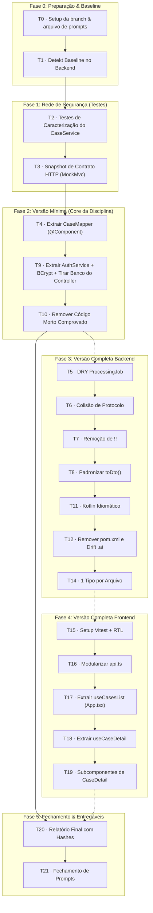

# Plano de Implementação: Refatoração e Auditoria — CaseFlow

**Base de Origem:** [`docs/relatorio-refatoracao.md`](file:///Users/marianepaz/git/caseflow/docs/relatorio-refatoracao.md)  
**Contexto Acadêmico:** Trabalho 2 da disciplina Engenharia de Software 2.0 (Prof. Luiz Real)  
**Repositório / Branch:** [`caseflow`](file:///Users/marianepaz/git/caseflow) na branch `refactoring` (a partir do commit `9de3812`)  
**Data de Criação:** Outubro de 2026  

---

## 1. Visão Geral e Estratégia de Entrega

O objetivo deste plano é guiar a execução técnica da refatoração da aplicação **CaseFlow**, cumprindo com precisão os critérios avaliativos da disciplina:

1. **Código refatorado na branch `refactoring`** com histórico de commits limpo e atômico (uma tarefa por commit).
2. **Arquivo de prompts de modernização** ([`docs/Prompts-Modernizacao-CaseFlow.md`](file:///Users/marianepaz/git/caseflow/docs/Prompts-Modernizacao-CaseFlow.md)) registrando cada instrução executada associada ao hash do respectivo commit.
3. **Relatório final de modernização** em Markdown/PDF demonstrando o antes/depois, os commits correlacionados e os números do baseline de qualidade.



---

## 2. Regras de Execução e Padrão de Rastreabilidade

Para cada tarefa $T_n$, deve-se seguir estritamente o seguinte ciclo:

1. **Executar a alteração**: aplicar o prompt recomendado ou executar a refatoração focada.
2. **Validar a integridade**: rodar os testes correspondentes (ex: `./gradlew test` ou `npm test`).
3. **Commit atômico**: realizar commit isolado com mensagem padronizada:
   ```bash
   git add <arquivos-alterados>
   git commit -m "refactor(T<n>): <descrição sucinta da intervenção>"
   ```
4. **Obter o hash curto do commit**:
   ```bash
   git rev-parse --short HEAD
   ```
5. **Registrar em `docs/Prompts-Modernizacao-CaseFlow.md`**:
   ```markdown
   ### T<n> · <Nome da Tarefa>
   - **Commit:** `<hash>`
   - **Prompt utilizado:**
   > <texto do prompt executado>
   - **Problema resolvido & Técnica aplicada:**
   <explicação técnica concisa do refactoring>
   ```

---

## 3. Trilha Principal: Versão Mínima (Entregáveis Críticos)

A versão mínima garante o cumprimento pleno de todos os requisitos do Trabalho 2 com foco nas falhas arquiteturais mais graves citadas no enunciado (especialmente a presença de acesso direto ao banco dentro do Controller e quebra de SRP).

### Fase 0: Setup e Baseline Numérico

#### **T0 · Validação de Branch e Inicialização do Arquivo de Prompts**
- **Objetivo:** Garantir que o trabalho está isolado na branch `refactoring` e inicializar o arquivo de registro de prompts.
- **Arquivos Afetados:** [`docs/Prompts-Modernizacao-CaseFlow.md`](file:///Users/marianepaz/git/caseflow/docs/Prompts-Modernizacao-CaseFlow.md).
- **Critério de Aceitação:** Arquivo de prompts criado com cabeçalho explicativo e tabela de rastreabilidade inicial vazia.
- **Commit:** `docs(T0): inicializar arquivo de prompts de modernizacao`

---

#### **T1 · Baseline Numérico com Detekt**
- **Objetivo:** Adicionar o plugin Detekt ao backend Gradle, rodar a análise inicial sem alterar código de aplicação e persistir o relatório como métrica inicial (*baseline*).
- **Arquivos Afetados:** [`backend/build.gradle.kts`](file:///Users/marianepaz/git/caseflow/backend/build.gradle.kts), `docs/detekt-baseline.md`.
- **Prompt:**
  > Adicione o plugin detekt ao build Gradle do backend com a configuração padrão. Rode `./gradlew detekt` e salve o relatório em markdown. Ao final, descreva brevemente o problema resolvido e a técnica aplicada.
- **Critério de Aceitação:** Relatório gerado com a contagem inicial de violações e *code smells* para comparação futura em T20.
- **Commit:** `build(T1): configurar detekt e salvar baseline numerico inicial`

---

### Fase 1: Rede de Segurança (Testes de Caracterização)

> [!IMPORTANT]
> Os testes de caracterização devem rodar e passar contra o código atual da v1 **antes** de qualquer refatoração, garantindo que o comportamento observável não mude.

#### **T2 · Testes de Caracterização do `CaseService`**
- **Objetivo:** Criar testes unitários cobrindo todos os fluxos críticos de [`CaseService.kt`](file:///Users/marianepaz/git/caseflow/backend/src/main/kotlin/com/caseflow/service/CaseService.kt):
  - `createCase`: criação em rascunho com protocolo gerado.
  - `submitCase`: caminho feliz com avanço para `ENVIADA` e job agendado; idempotência quando reenviado em estado terminal ou de processamento.
  - `retryCase`: bloqueio para não-administradores (`ForbiddenException`) e sucesso com `ROLE_ADMIN` em `FALHA_TECNICA`.
  - `updateCase`: validação de versão com rejeição em caso de mismatch (`ConflictException`).
- **Arquivos Afetados:** `backend/src/test/kotlin/com/caseflow/service/CaseServiceCharacterizationTest.kt`.
- **Prompt:**
  > Escreva testes de caracterização para CaseService cobrindo createCase, submitCase (caminho feliz e reenvio idempotente), retryCase (exige ADMIN) e updateCase (conflito de versão). Os testes devem passar contra o código atual, sem alterá-lo. Ao final, descreva brevemente o problema resolvido e a técnica aplicada.
- **Critério de Aceitação:** 100% dos testes passando contra a implementação atual sem tocar no código de produção.
- **Commit:** `test(T2): adicionar testes de caracterizacao para CaseService`

---

#### **T3 · Snapshot de Contrato HTTP com MockMvc**
- **Objetivo:** Proteger os contratos JSON da API para assegurar que refatorações subsequentes de DTO e Controller não alterem as respostas esperadas pelo cliente.
- **Endpoints Cobertos:**
  - `GET /bff/v1/cases/{id}/history`
  - `GET /bff/v1/notifications`
  - `POST /bff/v1/auth/login` (com credenciais do seed: `solicitante@caseflow.local` / `senha123`)
- **Arquivos Afetados:** `backend/src/test/kotlin/com/caseflow/controller/CaseContractSnapshotTest.kt`.
- **Prompt:**
  > Crie testes MockMvc que capturam o JSON atual de GET /bff/v1/cases/{id}/history, GET /bff/v1/notifications e POST /bff/v1/auth/login com a senha seedada correta, usando os dados do DataSeederService. Os testes devem passar contra o código atual. Ao final, descreva brevemente o problema resolvido e a técnica aplicada.
- **Critério de Aceitação:** Testes MockMvc validando estrutura, status HTTP e payloads JSON exatos.
- **Commit:** `test(T3): adicionar testes de snapshot de contrato HTTP`

---

### Fase 2: Refatoração do Core Mínimo

#### **T4 · Extração do `CaseMapper` (`@Component`)**
- **Objetivo:** Corrigir a violação do Princípio da Responsabilidade Única (SRP) em [`CaseService.kt`](file:///Users/marianepaz/git/caseflow/backend/src/main/kotlin/com/caseflow/service/CaseService.kt), extraindo o método [`toDto`](file:///Users/marianepaz/git/caseflow/backend/src/main/kotlin/com/caseflow/service/CaseService.kt#L199-L248) (que mistura busca de banco em `processingResultRepository`, parsing de JSON com Jackson `ObjectMapper` e mapeamento de DTOs) para uma classe dedicada [`CaseMapper`](file:///Users/marianepaz/git/caseflow/backend/src/main/kotlin/com/caseflow/service/mapper/CaseMapper.kt).
- **Arquivos Afetados:**
  - `backend/src/main/kotlin/com/caseflow/service/mapper/CaseMapper.kt` (novo componente).
  - [`backend/src/main/kotlin/com/caseflow/service/CaseService.kt`](file:///Users/marianepaz/git/caseflow/backend/src/main/kotlin/com/caseflow/service/CaseService.kt) (injeção do mapper e delegação).
- **Prompt:**
  > Aja como um Arquiteto de Software Kotlin/Spring. O método CaseService.toDto() mistura busca de dados, parsing de JSON e montagem de DTO. Extraia essa responsabilidade para uma classe CaseMapper (@Component), injetada em CaseService, mantendo o mesmo comportamento e a mesma saída. Ao final, descreva brevemente o problema resolvido e a técnica aplicada.
- **Critério de Aceitação:** `CaseService` não manipula mais `ObjectMapper` nem instancia `CaseResponseDto`. Testes T2 e T3 continuam passando intactos.
- **Commit:** `refactor(T4): extrair responsabilidade de mapeamento para CaseMapper`

---

#### **T9 · Extração do `AuthService`, Validação de Senha com BCrypt e Eliminação do Acesso Direto a Repositório no Controller**
- **Objetivo:**
  1. Eliminar a violação arquitetural grave de acesso direto a repositório (`AppUserRepository`) dentro de [`CaseController.kt`](file:///Users/marianepaz/git/caseflow/backend/src/main/kotlin/com/caseflow/controller/CaseController.kt#L32).
  2. Corrigir a vulnerabilidade de login onde qualquer senha era aceita sem checagem.
  3. Criptografar as senhas no seed ([`DataSeederService.kt`](file:///Users/marianepaz/git/caseflow/backend/src/main/kotlin/com/caseflow/service/DataSeederService.kt#L40-L48)) utilizando `BCryptPasswordEncoder`.
  4. Manter preservada a leitura do cabeçalho `X-User-Email` no `HeaderAuthFilter` para não quebrar o frontend atual.
- **Arquivos Afetados:**
  - `backend/src/main/kotlin/com/caseflow/service/AuthService.kt` (novo serviço).
  - [`backend/src/main/kotlin/com/caseflow/controller/CaseController.kt`](file:///Users/marianepaz/git/caseflow/backend/src/main/kotlin/com/caseflow/controller/CaseController.kt) (substituição do repositório por `AuthService`).
  - [`backend/src/main/kotlin/com/caseflow/service/DataSeederService.kt`](file:///Users/marianepaz/git/caseflow/backend/src/main/kotlin/com/caseflow/service/DataSeederService.kt) (hash com BCrypt nas contas padrão).
  - [`backend/src/main/kotlin/com/caseflow/config/SecurityConfig.kt`](file:///Users/marianepaz/git/caseflow/backend/src/main/kotlin/com/caseflow/config/SecurityConfig.kt) (Bean de `PasswordEncoder`).
- **Prompt:**
  > CaseController acessa AppUserRepository diretamente, o que é lógica de dados dentro do Controller, e o login não verifica senha. Extraia um AuthService com getCurrentUser() e login(), adicione PasswordEncoder BCrypt, faça o login validar a senha e faça o seeder gravar hashes. Não mexa no X-User-Email do HeaderAuthFilter. Ao final, descreva brevemente o problema resolvido e a técnica aplicada.
- **Critério de Aceitação:** `CaseController` desacoplado de `AppUserRepository`; login com senha incorreta retorna erro; senhas no banco gravadas com `$2a$...`; snapshot T3 passando com a senha correta.
- **Commit:** `refactor(T9): extrair AuthService com validacao BCrypt e desacoplar Controller do repositorio`

---

#### **T10 · Remoção de Código Morto Comprovado e Limpeza de Parâmetro Ignorado**
- **Objetivo:**
  1. Identificar métodos de repositório em [`Repositories.kt`](file:///Users/marianepaz/git/caseflow/backend/src/main/kotlin/com/caseflow/repository/Repositories.kt) sem nenhum chamador no backend ou frontend (ex: consultas não utilizadas).
  2. Remover o parâmetro `idempotencyKey` que é recebido nos métodos `submitCase` e `retryCase` de [`CaseService.kt`](file:///Users/marianepaz/git/caseflow/backend/src/main/kotlin/com/caseflow/service/CaseService.kt#L106-L156) e completamente ignorado, mantendo a assinatura HTTP do controller inalterada para manter compatibilidade.
- **Arquivos Afetados:**
  - [`backend/src/main/kotlin/com/caseflow/repository/Repositories.kt`](file:///Users/marianepaz/git/caseflow/backend/src/main/kotlin/com/caseflow/repository/Repositories.kt).
  - [`backend/src/main/kotlin/com/caseflow/service/CaseService.kt`](file:///Users/marianepaz/git/caseflow/backend/src/main/kotlin/com/caseflow/service/CaseService.kt).
- **Prompt:**
  > Remova os métodos de repositório e serviço que não têm nenhum chamador (verifique com busca em backend/src e frontend/src antes de apagar). Remova o parâmetro idempotencyKey que é aceito e ignorado, sem mudar a rota. Não remova /csrf nem /logout. Ao final, descreva brevemente o problema resolvido e a técnica aplicada.
- **Critério de Aceitação:** Build compilando perfeitamente; nenhum método com chamadores removido por engano; testes passando.
- **Commit:** `refactor(T10): remover metodos sem chamador em repositorios e parametro ignorado idempotencyKey`

---

## 4. Trilha Secundária: Versão Completa (Melhorias Complementares)

> [!TIP]
> Esta trilha é executada incrementalmente após a conclusão e validação da versão mínima, elevando a pontuação de qualidade técnica da entrega.

### 4.1. Melhorias de Backend

| Tarefa | Alvo | O que faz | Arquivos Afetados | Commit Sugerido |
| :--- | :--- | :--- | :--- | :--- |
| **T5** | `CaseService.kt` | Extrai método privado `createProcessingJob(caseRequest)` eliminando duplicação entre `submitCase` e `retryCase`. | [`CaseService.kt`](file:///Users/marianepaz/git/caseflow/backend/src/main/kotlin/com/caseflow/service/CaseService.kt) | `refactor(T5): eliminar duplicacao de criacao de ProcessingJob` |
| **T6** | `CaseService.kt` | Protege `generateProtocol()` contra colisão de banco com verificação de unicidade e retry limitado a 5 tentativas. | [`CaseService.kt`](file:///Users/marianepaz/git/caseflow/backend/src/main/kotlin/com/caseflow/service/CaseService.kt) | `fix(T6): garantir unicidade na geracao de protocolo com retry controlado` |
| **T7** | `AnalysisEngineService.kt` | Remove os operadores `!!` em `executeAnalysis`, substituindo por safe-call `?.let` e construções idiomáticas seguras de null-safety. | [`AnalysisEngineService.kt`](file:///Users/marianepaz/git/caseflow/backend/src/main/kotlin/com/caseflow/service/AnalysisEngineService.kt) | `refactor(T7): eliminar operadores de force unwrap !! em AnalysisEngineService` |
| **T8** | `SupportServices.kt` | Adiciona `toDto()` em `HistoryService` e `NotificationService`, transferindo a responsabilidade de montagem que estava no Controller. | [`SupportServices.kt`](file:///Users/marianepaz/git/caseflow/backend/src/main/kotlin/com/caseflow/service/SupportServices.kt), [`CaseController.kt`](file:///Users/marianepaz/git/caseflow/backend/src/main/kotlin/com/caseflow/controller/CaseController.kt) | `refactor(T8): delegar mapeamento DTO de historico e notificacoes aos servicos` |
| **T11** | `DocumentService.kt` & `CaseService.kt` | Troca cálculo manual de SHA-256 via `fold` por `java.util.HexFormat.of().formatHex()`; simplifica cadeias de `\|\|` usando operador `in`. | [`DocumentService.kt`](file:///Users/marianepaz/git/caseflow/backend/src/main/kotlin/com/caseflow/service/DocumentService.kt), [`CaseService.kt`](file:///Users/marianepaz/git/caseflow/backend/src/main/kotlin/com/caseflow/service/CaseService.kt) | `refactor(T11): aplicar construcoes idiomaticas Kotlin com HexFormat e in set` |
| **T12** | `pom.xml` & `.ai/` | Remove [`backend/pom.xml`](file:///Users/marianepaz/git/caseflow/backend/pom.xml) duplicado; ajusta divergências em `.ai/standards.md` para alinhar ao código real (`CaseService`, `errorCode`). | [`backend/pom.xml`](file:///Users/marianepaz/git/caseflow/backend/pom.xml), `.ai/standards.md` | `chore(T12): remover pom.xml nao utilizado e alinhar documentacao em .ai` |
| **T13** | `build.gradle.kts` | *(Opcional / Risco Monitorado)* Atualiza Spring Boot para linha LTS recente caso viável sem quebrar compatibilidade do SpringDoc. | [`backend/build.gradle.kts`](file:///Users/marianepaz/git/caseflow/backend/build.gradle.kts) | `chore(T13): atualizar dependencias do Spring Boot e SpringDoc` |
| **T14** | `SecurityConfig.kt` & `SupportServices.kt` | Separa classes aninhadas em arquivos dedicados: `CurrentUserContext.kt`, `HeaderAuthFilter.kt`, `HistoryService.kt` e `NotificationService.kt`. | `backend/src/main/kotlin/com/caseflow/...` | `refactor(T14): separar classes em arquivos proprios respeitando 1 tipo por arquivo` |

---

### 4.2. Melhorias de Frontend

| Tarefa | Alvo | O que faz | Arquivos Afetados | Commit Sugerido |
| :--- | :--- | :--- | :--- | :--- |
| **T15** | `frontend/package.json` | Configura Vitest e React Testing Library com `jsdom` e adiciona teste de fumaça para [`StatusBadge.tsx`](file:///Users/marianepaz/git/caseflow/frontend/src/components/StatusBadge.tsx). | `frontend/package.json`, `vite.config.ts`, `StatusBadge.test.tsx` | `test(T15): configurar vitest e adicionar testes unitarios para StatusBadge` |
| **T16** | `services/api.ts` | Decompõe o arquivo monólito de 754 linhas em: `fixtures.ts` (dados de mock), `mockAdapter.ts`, `httpClient.ts` e helper genérico `withFallback()`. | [`frontend/src/services/api.ts`](file:///Users/marianepaz/git/caseflow/frontend/src/services/api.ts) | `refactor(T16): modularizar api.ts em cliente HTTP e adaptador de fallback` |
| **T17** | `App.tsx` | Extrai custom hook `useCasesList(currentUser)` e funções puras `filterCases` e `computeStats`; elimina `any` de notificações. | [`frontend/src/App.tsx`](file:///Users/marianepaz/git/caseflow/frontend/src/App.tsx), `hooks/useCasesList.ts` | `refactor(T17): extrair useCasesList e tipar notificacoes estritamente no App` |
| **T18** | `CaseDetail.tsx` | Extrai custom hook `useCaseDetail(caseId, currentUser)` com controle de estado, polling e mutations de documento/submissão. | [`frontend/src/components/CaseDetail.tsx`](file:///Users/marianepaz/git/caseflow/frontend/src/components/CaseDetail.tsx), `hooks/useCaseDetail.ts` | `refactor(T18): extrair logica de estado e polling para useCaseDetail` |
| **T19** | `CaseDetail.tsx` | Decompõe os três formulários em subcomponentes puros: `DocumentUploadForm.tsx`, `RetryModal.tsx` e `CaseHistoryTimeline.tsx`. | [`frontend/src/components/CaseDetail.tsx`](file:///Users/marianepaz/git/caseflow/frontend/src/components/CaseDetail.tsx), `components/CaseDetail/...` | `refactor(T19): decompor CaseDetail em subcomponentes especializados` |

---

## 5. Fechamento e Consolidação dos Entregáveis (Fase Final)

### **T20 · Relatório Final de Modernização**
- **Objetivo:**
  1. Executar novamente o Detekt (`./gradlew detekt`) e comparar os indicadores com o baseline de T1.
  2. Consolidar o relatório final em [`docs/relatorio-refatoracao.md`](file:///Users/marianepaz/git/caseflow/docs/relatorio-refatoracao.md) contendo a tabela final rastreável exigida pelo professor:
     - Tabela completa de intervenções com o hash curto de commit de cada tarefa realizada.
     - Justificativa técnica formal dos itens deixados de fora (ex: preservação do cabeçalho `X-User-Email` e `Thread.sleep` de simulação assíncrona).
     - Comparativo numérico de antes vs. depois.
- **Commit:** `docs(T20): consolidar relatorio final de modernizacao com metricas e hashes`

---

### **T21 · Fechamento do Arquivo de Prompts**
- **Objetivo:** Atualizar [`docs/Prompts-Modernizacao-CaseFlow.md`](file:///Users/marianepaz/git/caseflow/docs/Prompts-Modernizacao-CaseFlow.md) garantindo que todas as tarefas concluídas contenham exatamente o prompt digitado, o hash do commit correspondente e a explicação da técnica aplicada.
- **Commit:** `docs(T21): finalizar arquivo de prompts de modernizacao com historico completo`

---

## 6. Checklist de Validação Final da Entrega

Antes de dar o trabalho como concluído, checar item a item:

- [ ] A branch ativa é `refactoring` e todos os commits foram realizados nela.
- [ ] `./gradlew test` roda e passa com 100% de sucesso.
- [ ] `./gradlew detekt` executa sem erros fatais.
- [ ] No frontend, `npm run build` executa sem nenhum erro de compilação ou tipagem.
- [ ] Todos os commits citados no relatório existem no histórico (`git log --oneline`).
- [ ] O arquivo [`docs/Prompts-Modernizacao-CaseFlow.md`](file:///Users/marianepaz/git/caseflow/docs/Prompts-Modernizacao-CaseFlow.md) está preenchido e sincronizado com os hashes.
- [ ] Nenhum `git push` foi realizado sem alinhamento prévio com os demais membros do grupo.
